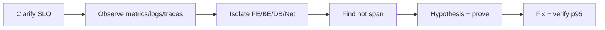
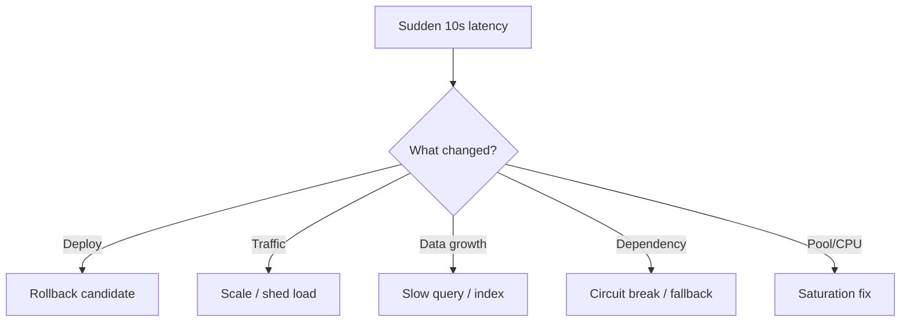

# Part A — Debugging & Performance (Q01–Q10)

[← Back to Index](00-INDEX.md)

---

<a id="q01"></a>
## Q01 — How would you debug a slow API? ⭐🔧

### Thought process (what interviewers want)
Do **not** jump to “add an index” or “use Redis.” Show a **measurement-first** pipeline: clarify → observe → isolate layer → find hot path → prove cause → fix.

### Answer (step-by-step)

1. **Clarify**
   - Which endpoint? All users or a segment? Since when? p50 vs p95/p99?
   - SLO (e.g. p95 < 300 ms)? Is it latency, throughput, or timeouts?

2. **Reproduce & measure**
   - Hit the API with `curl` / Postman and note total time.
   - Check APM (Datadog, New Relic, Elastic APM) or OpenTelemetry traces for that `request_id`.
   - Split time: gateway → app → DB → cache → downstream.

3. **Isolate the layer**
   - Network/DNS/TLS?
   - App CPU / event loop lag (Node.js)?
   - DB slow query?
   - External dependency timeout?

4. **Zoom into the hot path**
   - Enable query logging / `explain`.
   - Check N+1 queries, large payloads, sync I/O, missing indexes, lock waits.
   - Profile CPU if app-bound (`clinic flame`, `--cpu-prof`).

5. **Fix with evidence**
   - One change at a time; compare before/after p95.
   - Add regression test or load scenario so it doesn’t return.



### Real-world example
A Node.js `/orders` API p95 jumped from 180 ms → 2.4 s. Trace showed 40 MongoDB `find`s per request (N+1). Fixed with `$in` / aggregation + Redis cache for product catalog. p95 returned to ~220 ms.

### Common follow-ups
- How do you debug without APM?
- Difference between mean and p99?
- What if only some tenants are slow?

### What not to say
- “I’d just add Redis / more pods.”
- “I’d restart the server.”
- Guessing without mentioning metrics or traces.

---

<a id="q02"></a>
## Q02 — Once you identify the bottleneck, how would you improve API performance? ⭐

### Thought process
Match the fix to the **bottleneck type**. Interviewers score trade-off awareness (correctness, cost, complexity).

### Answer by bottleneck type

| Bottleneck | Improvements |
|------------|----------------|
| **DB query** | Index, rewrite query, projection, pagination, denormalize carefully |
| **N+1 queries** | Batch / join / `$lookup` / DataLoader |
| **Serialization / large payload** | Pagination, field filtering, compression, CDN for static |
| **CPU-bound (Node)** | Move to worker threads / queue / separate service |
| **External API** | Cache, timeout, circuit breaker, async fan-out |
| **Lock contention** | Shorter transactions, optimistic locking, queue writes |
| **Cold cache / thrash** | Warm cache, better TTL, stampede protection |
| **Under-provisioned** | Horizontal scale + connection pooling limits |

**Order of preference (usually):**
1. Fix algorithmic / query waste (biggest ROI)
2. Cache read-heavy stable data
3. Async non-critical work (Kafka / SQS)
4. Scale out replicas
5. Vertical scale (last resort for app tier)

### Real-world example
Checkout API spent 800 ms calling a payment “status” sync API. Moved status poll to a background job + webhook; checkout returned in 120 ms with an `pending` state.

### Common follow-ups
- Cache vs denormalization?
- When is premature optimization wrong?
- How do you know the fix worked in prod?

### What not to say
- Only “scale the servers” for a bad O(n²) query.
- Ignoring data consistency when caching.

---

<a id="q03"></a>
## Q03 — How do you investigate high response times in production? ⭐🔧

### Thought process
Production = **blast radius first**, then root cause. Parallel: mitigate + investigate.

### Answer

1. **Confirm the signal**
   - Dashboard: latency by endpoint, error rate, saturation (CPU, memory, DB connections).
   - Is it global or regional / one pod / one customer?

2. **Timeline correlation**
   - Deployments, config changes, traffic spikes, cron jobs, index builds, Redis failover.

3. **Golden signals** (Google SRE)
   - Latency, traffic, errors, saturation.

4. **Traces for slow requests**
   - Pick a slow `trace_id`; find the longest span.

5. **Resource checks**
   - K8s: pod CPU throttling, OOMKilled, HPA thrashing.
   - MongoDB: slow query log, currentOp, replication lag.
   - Redis: latency, evictions, connection count.

6. **Mitigate if needed**
   - Rollback, scale out, disable feature flag, shed load, increase timeout carefully (often wrong).

### Real-world example
After a K8s deploy, p99 spiked. Traces were fine in app code; nodes showed CPU throttling because `resources.limits.cpu` was too low. Raised limits / requests; p99 recovered.

### Common follow-ups
- How do you investigate without waking the whole team?
- How do SLOs/error budgets guide response?

### What not to say
- “I’d SSH into production and start editing code.”
- Changing timeouts as the only fix.

---

<a id="q04"></a>
## Q04 — API fine yesterday, now takes 10 seconds — how do you troubleshoot? ⭐🔧

### Thought process
**Sudden** change ⇒ look for **what changed**, not rewrite architecture.

### Answer (ordered checklist)

1. **Blast radius & impact** — one endpoint or all? errors or just slow?
2. **Change log** — deploy, feature flag, infra, DNS, cert, partner API.
3. **Compare yesterday vs today** — traffic, error rate, DB CPU, Redis hit rate.
4. **Is it waiting?**
   - 10 s often = **timeout** (default client timeout, LB, Mongo `maxTimeMS`, upstream).
5. **Dependency health** — third-party status page, DNS resolution, TLS handshake.
6. **Data shape change** — collection grew; missing index; unselective query suddenly scans millions.
7. **Resource exhaustion** — connection pool full (requests queue 10 s), disk full, thread/event-loop blocked.
8. **Mitigate** — rollback / disable flag / failover; then RCA.



### Real-world example
An endpoint hit Mongo with `{ email: ... }` without an index. Dataset was small until a bulk import overnight. Collection scan → ~10 s. Added index + `explain("executionStats")` in CI for critical queries.

### Common follow-ups
- How do you do a blameless RCA?
- Difference between regression and capacity cliff?

### What not to say
- “Maybe the internet is slow.”
- Long architecture lecture before checking yesterday’s deploy.

---

<a id="q05"></a>
## Q05 — Frontend vs backend vs database vs network — how do you isolate? ⭐

### Thought process
Use **boundaries** and measured timings at each hop.

### Answer

| Layer | How to isolate | Signals |
|-------|----------------|---------|
| **Frontend** | Chrome DevTools Network/Performance; disable cache; Lighthouse | TTFB low but total high → render/JS; large bundles; waterfall of many calls |
| **Network** | Compare client RTT vs server-side duration; traceroute; CDN | High TTFB with low server time; TLS/DNS delays; packet loss |
| **Backend** | Server logs / APM span for handler only | High app time, DB spans short |
| **Database** | Slow query log, `explain`, DB CPU | Long DB span; high `docsExamined` |

**Practical split:**
1. Measure **TTFB** vs **content download** vs **JS execution**.
2. Call the API **directly** (curl from same region as server, then from client region).
3. If curl is fast but browser is slow → FE or client network / many round trips.
4. If curl is slow → BE/DB/dependency; open the trace.

### Real-world example
Users said “API is slow.” DevTools showed 20 sequential API calls from React (waterfall). Backend each call was 40 ms; page felt 800 ms+. Fixed with a BFF aggregate endpoint.

### Common follow-ups
- How do CDNs affect this analysis?
- Cross-region latency?

### What not to say
- Blaming frontend or backend without timing evidence.
- “I’d ask the other team.”

---

<a id="q06"></a>
## Q06 — What metrics do you check first when an application becomes slow? ⭐

### Thought process
Lead with **golden signals** + **dependency saturation**, not random CPU graphs.

### Answer — first 60–90 seconds

1. **Request rate** (RPS) — spike or drop?
2. **Latency** — p50 / p95 / p99 by endpoint
3. **Error rate** — 5xx, 4xx, timeouts
4. **Saturation**
   - App: CPU, memory, event-loop lag, GC pause
   - DB: CPU, connections, lock/wait, replication lag
   - Cache: hit ratio, evictions, latency
   - Queue: depth / consumer lag
5. **Recent deploys / config**
6. **Dependency latency** (payment, email, search)

### Real-world example
Grafana showed RPS flat, p99 up, Redis `evicted_keys` rising after a memory limit change. Cache miss storm hit Mongo → DB CPU 100%. Raised Redis memory + added stampede locks.

### Common follow-ups
- RED vs USE method?
- Which latency percentile matters for SLOs?

### What not to say
- Only “CPU and memory” with no request/error context.
- Ignoring saturation of pools and queues.

---

<a id="q07"></a>
## Q07 — How do you identify memory leaks in a Node.js application? ⭐🔧

### Thought process
Prove **unbounded growth** that GC cannot reclaim, then find retaining paths.

### Answer

1. **Confirm leak vs healthy growth**
   - Graph `process.memoryUsage().heapUsed` over hours under steady load.
   - Leak: sawtooth rises (GC runs) but **baseline keeps climbing**.

2. **Runtime signals**
   - Frequent GC, rising RSS, container OOMKilled, longer GC pauses → latency.

3. **Heap snapshots**
   - `node --inspect` + Chrome DevTools → take 2–3 heaps under load → Comparison view.
   - Look for growing detached DOM (rare in BE), closures, caches, event listeners, global Maps.

4. **Allocation timelines**
   - Clinic.js Heapprofiler, `heapdump`, `v8-profiler`.

5. **Common Node leak sources**
   - Unbounded in-memory cache / arrays
   - Global memoization without TTL
   - Uncleared `setInterval` / listeners (`EventEmitter` leaks)
   - Closures capturing large request objects
   - Mongo/Redis client misuse (growing buffers)
   - Module-level caches keyed by unbounded user input

6. **Reproduce** with sustained load (Artillery/JMeter) in staging with same Node version.

### Real-world example
A middleware logged full request bodies into a module-level array “for debugging” behind a flag left on in prod. Heap comparison showed millions of String objects. Removed buffer; added size-capped ring logger.

### Common follow-ups
- heapUsed vs RSS?
- How do worker threads affect memory?

### What not to say
- “I’d increase the memory limit” as the fix.
- Confusing normal GC sawtooth with a leak.

---

<a id="q08"></a>
## Q08 — How do you debug high CPU utilization? 🔧

### Thought process
CPU high is a **symptom**. Find **which process/code** and whether it’s useful work vs thrash.

### Answer

1. **Whose CPU?**
   - App pods, MongoDB, Redis, node-exporter on noisy neighbor?

2. **Correlate with RPS**
   - High CPU + high RPS = maybe expected; capacity issue.
   - High CPU + normal RPS = hot loop / regex / crypto / JSON parse / compression.

3. **Profile**
   - Node: `node --cpu-prof`, Clinic Flame, 0x, pyroscope/Datadog profiler.
   - Look for wide flame frames (hot functions).

4. **Check systemic causes**
   - Tight `while` / sync crypto (`bcrypt` cost too high on request path)
   - JSON.stringify on huge objects
   - Busy polling
   - Infinite retry storms
   - MongoDB collection scans (DB CPU)

5. **Mitigate**
   - Rate limit, kill runaway job, roll back, move CPU work off request path.

### Real-world example
CPU pegged after enabling response compression on multi‑MB JSON exports. Moved exports to async job + gzipped file to S3; API CPU normalized.

### Common follow-ups
- CPU throttling in Kubernetes?
- How do you profile safely in production?

### What not to say
- Restart as the only action.
- “CPU high means we need microservices.”

---

<a id="q09"></a>
## Q09 — How do you debug an application that crashes randomly? 🔧

### Thought process
“Random” usually means **missing correlation**. Make it measurable: crash dumps, exit codes, OOM, unhandled rejections.

### Answer

1. **Classify the crash**
   - Process exit: uncaughtException / unhandledRejection
   - OOMKilled (137) in K8s
   - Health check flapping → kubelet restart
   - Segmentation fault (native addons)
   - Deployment rollout / eviction

2. **Capture evidence**
   - Exit codes, last logs, core dumps, Node `--report-on-fatalerror`
   - Correlate with traffic, GC, deploy, cron, feature flag

3. **Stabilize logging**
   - Global handlers that log stack + request context, then graceful shutdown
   - Never empty `catch`

4. **Reproduce with chaos**
   - Soak test, memory pressure, dependency latency injection

5. **Typical causes**
   - Race conditions under concurrency
   - Native module bugs
   - Memory leak → eventual OOM
   - Shared mutable state
   - Connection pool exhaustion leading to cascading failures (looks like crash)

### Real-world example
Pods “randomly” restarted. Events showed OOMKilled at ~1.5 GB. Heap dump after 4-hour soak revealed unbounded Bull queue job payloads held in memory. Capped concurrency + stored payloads in Redis/S3.

### Common follow-ups
- How do you do graceful shutdown in Node/K8s?
- Difference between crash loop and liveness misconfig?

### What not to say
- “Add more try/catch everywhere” without root cause.
- Ignoring OOM vs application exceptions.

---

<a id="q10"></a>
## Q10 — How would you optimize a database query? ⭐

### Thought process
Measure with `explain`, then fix selectivity, shape, and access pattern — not “add random indexes.”

### Answer (MongoDB-focused, transferable)

1. **Measure**
   - `explain("executionStats")` — `IXSCAN` vs `COLLSCAN`, `docsExamined` / `nReturned`, time.
2. **Reduce scanned work**
   - Index matching filter + sort.
   - Equality → sort → range (ESR rule) for compound indexes.
3. **Return less data**
   - Projection, pagination (`limit` + range), avoid huge `$lookup` results.
4. **Rewrite query shape**
   - Avoid `$where`, inefficient regex (`/^abc/` can use index; `/abc/` often can’t).
   - Prefer covering queries when possible.
5. **Schema / access pattern**
   - Embed vs reference based on read pattern.
   - Pre-aggregate for hot dashboards.
6. **Operational**
   - Avoid large multi-document transactions when unnecessary.
   - Check for lock waits / replication lag affecting secondaries.

```js
// Bad: collection scan risk
db.orders.find({ userId: 42, status: "OPEN" }).sort({ createdAt: -1 })

// Better: compound index supporting filter + sort
// { userId: 1, status: 1, createdAt: -1 }
```

### Real-world example
Report query scanned 12M docs. Compound index + date range bound + projection cut examined docs to ~2k; 18 s → 90 ms.

### Common follow-ups
- Covered queries?
- When does an index hurt writes?
- Aggregation pipeline optimization?

### What not to say
- “Index every field.”
- Optimizing without `explain` numbers.

---

[← Back to Index](00-INDEX.md) · [Next: Production Issues →](02-production-issues.md)
