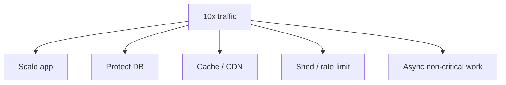

# Part B — Production Issues (Q11–Q18)

[← Back to Index](00-INDEX.md) · [← Debugging](01-debugging-performance.md)

---

<a id="q11"></a>
## Q11 — Deployed a new version; users report errors. What would you do? ⭐🗣️

### Thought process
**Stop the bleeding first**, then diagnose. Interviewers want incident discipline, not hero debugging.

### STAR answer

- **Situation:** New version deployed; spike in 5xx / support tickets.
- **Task:** Restore service quickly and limit customer impact.
- **Action:**
  1. Acknowledge incident; declare severity; open war room channel.
  2. Check error rate, latency, logs for new stack traces / correlation IDs.
  3. Confirm deploy window matches onset.
  4. **Mitigate:** feature-flag off, or **rollback** / previous ReplicaSet image (K8s), or blue-green switch.
  5. Verify golden signals recover.
  6. Reproduce in staging from the bad artifact; write failing test; fix forward if rollback isn’t enough (migrations).
  7. Blameless postmortem + alert if missing.
- **Result:** Error rate back to baseline in minutes; root cause documented.

### Extra depth
- If DB migration is forward-only, rollback app may fail → expand/contract migrations, dual-write awareness.
- Canary / progressive delivery reduces this class of incident.

### Common follow-ups
- Rollback vs fix-forward?
- How do you handle breaking schema changes?

### What not to say
- “I’d keep debugging in production while users suffer.”
- “I’d SSH and hotfix live without tracking.”

---

<a id="q12"></a>
## Q12 — Production bug cannot be reproduced locally. How would you investigate? ⭐🗣️

### Thought process
Environment parity gaps + data/concurrency differences. Bring **prod evidence** to a safe repro.

### STAR answer

- **Situation:** Bug only in prod; local happy path works.
- **Task:** Capture enough production truth to reproduce or fix safely.
- **Action:**
  1. Gather: request payload, headers, tenant/user id, `trace_id`, app version, region, time.
  2. Diff environments: config, feature flags, secrets, Node/Mongo versions, connection counts.
  3. Check **data-dependent** paths (nulls, large arrays, unicode, legacy rows).
  4. Check **race/load**: only under concurrency; use staging soak + prod-like data subset.
  5. Add **targeted logging/metrics** behind flag (careful with PII).
  6. Use shadow traffic or session replay if available.
  7. Reproduce in staging with anonymized prod-like fixture.
- **Result:** Root cause found in config/data race; test added.

### Real-world example
Bug only for users with >500 roles embedded in JWT. Local test users had 2 roles. Token parsing + large middleware clone blew CPU. Fixed with role IDs fetch + size guard.

### Common follow-ups
- How do you debug without copying prod data (compliance)?
- Canaries and fault injection?

### What not to say
- “If I can’t reproduce it, it’s not a bug.”
- Asking for unrestricted prod DB dump casually.

---

<a id="q13"></a>
## Q13 — Application works locally but not in production. How do you debug? ⭐

### Thought process
Treat as **parity + integration** problem.

### Answer — systematic diff

| Area | Local | Prod traps |
|------|-------|------------|
| Config | `.env` | Missing env, wrong URL, case sensitivity |
| Networking | localhost | DNS, private VPC, TLS, mTLS, security groups |
| Auth | mocks | Real IdP, clock skew (JWT `exp`) |
| Data | tiny fixtures | charset, indexes, collations |
| Resources | unlimited | K8s limits, file descriptors |
| Dependencies | same process | Wrong Redis DB index, read replica lag |
| Build | `npm run dev` | minification, `NODE_ENV=production` behavior |

**Steps:** compare config maps; hit health/readiness; check egress; validate migrations ran; compare image digest; reproduce with prod compose/profile.

### Real-world example
`localhost` Mongo URI left as fallback when `MONGODB_URI` unset. Locally fine; prod connected nowhere useful → crash loop. Added startup fail-fast if required env missing.

### Common follow-ups
- Twelve-factor config?
- How do Docker multi-stage builds cause “works on my machine”?

### What not to say
- “Production is broken, local is source of truth.”
- Disabling TLS/auth in prod to “make it work.”

---

<a id="q14"></a>
## Q14 — Customer reports intermittent failures. How do you approach? 🗣️

### Thought process
Intermittent ⇒ race, partial outage, specific shard/region, rate limits, or client retries.

### STAR answer

- **Situation:** One customer sees flaky failures; others mostly fine.
- **Task:** Determine if isolated or early signal of systemic issue.
- **Action:**
  1. Get exact times, user/tenant id, device, steps, screenshots, request IDs.
  2. Search logs for that tenant; check error codes (429, 503, 504).
  3. Check multi-AZ / pod imbalance / sticky sessions.
  4. Look for dependency timeouts with retries (amplification).
  5. Check rate limits / quota for that API key.
  6. Reproduce with concurrent requests for that account’s data shape.
  7. Add tenant-scoped dashboard while investigating.
- **Result:** Found rate-limit misconfig for their API key; raised quota + better 429 headers.

### Common follow-ups
- How do you communicate with the customer during investigation?
- Idempotency for retries?

### What not to say
- “Ask them to refresh.”
- Dismissing as “cannot reproduce” without log search.

---

<a id="q15"></a>
## Q15 — Service starts returning 500 errors. What would you do? ⭐🗣️

### Thought process
500 = server failed. Triage severity, mitigate, then root cause.

### STAR answer

- **Situation:** Sudden 5xx spike on an API service.
- **Task:** Restore availability and protect dependencies.
- **Action:**
  1. Confirm scope (one service vs mesh-wide).
  2. Check logs for exception class / panic / DB errors.
  3. Check deps: Mongo primary stepdown, Redis, Kafka, third parties.
  4. Check saturation: pool exhausted → timeouts surfaced as 500s (should often be 503).
  5. Mitigate: rollback, scale, circuit-break bad dependency, enable degraded mode.
  6. Fix: correct error mapping, retries with jitter, bulkheads.
- **Result:** Availability restored; improved failure classification.

### Real-world example
Mongo connection pool exhausted under traffic; drivers threw; app returned 500. Increased pool carefully + fail fast with 503 + retry-after; added pool wait metrics.

### Common follow-ups
- 500 vs 502 vs 503 vs 504?
- Should clients retry on 500?

### What not to say
- Catch-all `res.status(500)` hiding root errors without logging.
- Infinite retries on 500.

---

<a id="q16"></a>
## Q16 — Suddenly 10x traffic. What happens, and how do you handle it? ⭐

### Thought process
Describe **failure cascade**, then **absorb / shed / scale**.

### What typically happens
1. App CPU/latency rises; queues form at LB.
2. DB connections max out → timeouts → retries → **retry storm**.
3. Cache miss ratio may worsen; Redis CPU spikes.
4. Pods OOM or fail health checks → fewer pods → worse overload.
5. Downstream third parties throttle you.

### How you handle it

**Immediate**
- Autoscale (HPA) if lagging, manually scale.
- Enable caching / CDN for read endpoints.
- Rate limit / load shed non-critical traffic.
- Disable expensive features via flags.
- Protect DB: reduce pool per pod if multiplying pods blindly; use queue for writes.

**Short-term**
- Read replicas, async processing, CQRS for hot paths.
- Backpressure (HTTP 503 + Retry-After).

**Long-term**
- Capacity planning, load tests, caching strategy, queue-based architecture.



### Common follow-ups
- How do you avoid autoscaling making DB worse?
- Graceful degradation examples?

### What not to say
- “Kubernetes will handle it” with no DB/cache plan.
- Blindly multiplying pods without pool math.

---

<a id="q17"></a>
## Q17 — How would you investigate an Out Of Memory (OOM) error? 🔧

### Thought process
Distinguish **container OOMKill** vs **JS heap OOM** vs **native RSS**.

### Answer

1. **Identify killer**
   - K8s event `OOMKilled`, exit 137 → cgroup limit.
   - `JavaScript heap out of memory` → V8 heap.

2. **Graph memory before crash**
   - RSS vs heapUsed; container limit vs request.

3. **Capture heap dump** on staging soak approaching limit.

4. **Check common causes**
   - Large response buffering
   - Unbounded queues/caches
   - File read into memory (`fs.readFile` huge uploads)
   - Memory leak (Q07/Q36)
   - Too many workers in one pod

5. **Mitigate**
   - Raise limit temporarily **only** with root-cause plan
   - Stream responses; limit payload sizes; fix leak
   - Set appropriate Node `--max-old-space-size` aligned with cgroup

### Real-world example
Users uploaded 200 MB CSV; service used `readFile` + parse in memory. Streamed with `csv-parse` + row limits; OOM stopped.

### Common follow-ups
- How do requests/limits interact with Node heap?
- Sidecar memory accounting?

### What not to say
- Only bumping memory forever.
- Ignoring streaming for large files.

---

<a id="q18"></a>
## Q18 — What steps do you follow when debugging a production issue? ⭐

### Thought process
This is a **process** question. Give a repeatable runbook.

### Answer — production debugging runbook

1. **Detect & declare** — severity, commander, comms.
2. **Define user impact** — what is broken, SLO burn.
3. **Stabilize** — rollback / scale / flag / shed (parallel to investigation).
4. **Timeline** — onset, deploys, infra events.
5. **Telemetry triangle** — metrics + logs + traces.
6. **Hypothesize narrowly** — 1–2 causes; test them.
7. **Resolve & verify** — dashboards + synthetic checks + user confirmation.
8. **Follow-up** — postmortem, action items, tests, alerts, runbooks.

```text
IMPACT → STABILIZE → EVIDENCE → CAUSE → FIX → VERIFY → LEARN
```

### What not to say
- Skipping mitigation to “fully understand first” during SEV-1.
- Skipping postmortem / lasting fixes.

---

[← Back to Index](00-INDEX.md) · [Next: Scalability →](03-scalability.md)
