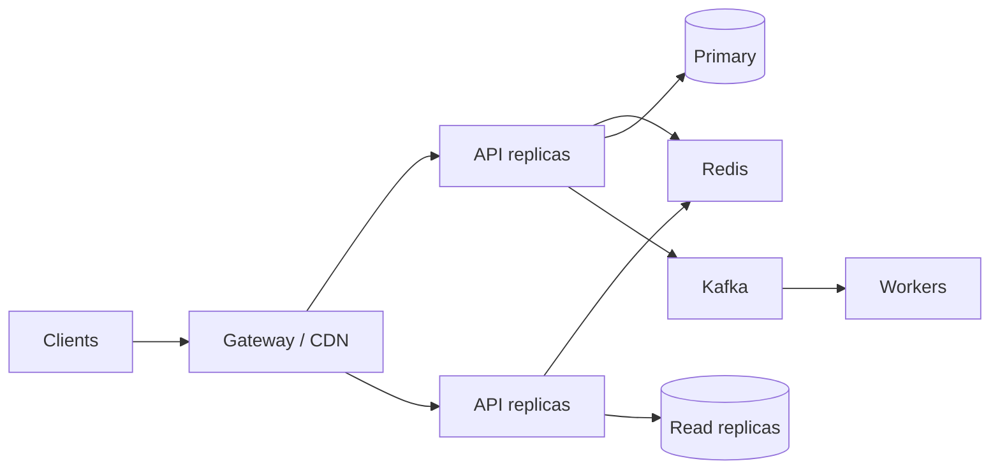

# Part C — Scalability (Q19–Q24)

[← Back to Index](00-INDEX.md)

---

## Q19 — Scale an API from 100 rps to 10,000 rps ⭐📐

### Thought process
100× is not “10× more pods.” Find bottleneck at each order of magnitude; redesign hot paths.

### Answer — layered plan

**1. Measure baseline (100 rps)**  
p99, DB QPS, cache hit %, CPU per request, payload size.

**2. App tier (→ ~1–2k rps often)**  
- Stateless horizontal scale behind LB  
- Connection pooling discipline  
- Remove sync CPU on request path  
- Keep payloads small  

**3. Data tier (the real wall)**  
- Indexes for hot queries  
- Redis for read-heavy keys  
- Read replicas / CQRS  
- Shard by tenant/user when single primary saturates  
- Move writes to Kafka + workers where eventual consistency OK  

**4. Edge**  
- CDN for static / cacheable GETs  
- Rate limits / WAF  
- API gateway aggregation  

**5. Validate with load tests** at 2k → 5k → 10k; watch DB first.

### Real-world example
Auth session validation at 8k rps crushed Mongo. Moved sessions to Redis with TTL; Mongo QPS dropped ~70%; 10k rps sustained.

### Common follow-ups
- How do you calculate connections: `pods × poolSize` vs Mongo `maxIncomingConnections`?
- Sticky sessions — why avoid them?

### What not to say
- “Just add Kubernetes.”
- Sharding as step one without caching/indexing.

---

## Q20 — Millions of users — what changes? 📐

### Thought process
Product + architecture + org. Show multi-tenant, multi-region, cost, and operability thinking.

### Answer — capability shifts

| Area | Early stage | Millions of users |
|------|-------------|-------------------|
| Architecture | Monolith OK | Modular monolith or services on bounded contexts |
| Data | Single DB | Sharding, CQRS, specialized stores |
| Delivery | Manual deploys | Progressive delivery, feature flags |
| Observability | Basic logs | SLO-based, tracing, cardinality control |
| Multi-region | Optional | Active-active or failover |
| Security | Basic auth | Abuse detection, zero-trust internals |
| Cost | Ignore | FinOps, cache, tiered storage |

Also: onboarding/careful migrations, privacy (GDPR), support tooling, rate limits per tenant.

### Common follow-ups
- When to split microservices?
- Hot partition / celebrity tenant problem?

### What not to say
- “Rewrite everything in microservices on day one.”

---

## Q21 — How would you reduce load on the database? ⭐

### Thought process
Reduce **QPS**, **query cost**, and **lock contention**.

### Answer — toolkit

1. **Cache** hot reads (Redis) with TTL + invalidation  
2. **Indexes** + kill COLLSCAN on hot paths  
3. **Batch / avoid N+1**  
4. **Pagination** and projections  
5. **Read replicas** for eventually consistent reads  
6. **Async writes** / queues for non-critical persistence  
7. **Materialized views** / pre-aggregation  
8. **Connection pooling** + avoid over-pooling from too many pods  
9. **Short transactions**; avoid chatty multi-round trips  
10. **CDN / app-level cache** for public content  

### Real-world example
Product detail page: 12 Mongo queries → 1 cached document in Redis (30–60 s TTL) + pub/sub invalidation on admin edit. DB load −60% at peak.

### Common follow-ups
- Cache stampede prevention?
- Read-your-writes inconsistency with replicas?

### What not to say
- Caching everything forever.
- Replicas for strong consistency needs without caveats.

---

## Q22 — Design an application to handle peak traffic 📐

### Thought process
Peaks are **expected** (launches, sales). Design for **elastic + protective** behavior.

### Answer

**Before peak**
- Load test peak profile (JMeter/k6)
- Pre-warm caches / CDN
- Pre-scale pods / DB capacity
- Feature flags for expensive paths

**During peak**
- Autoscale on CPU / RPS / queue lag / p95
- Rate limit abusive clients
- Degrade: static fallbacks, delay non-critical emails/analytics
- Queue checkouts / orders if needed (inventory reservation pattern)

**After peak**
- Scale down carefully (DB cool-down)
- Review errors, saturation, cost

### Architecture patterns
- CQRS for read-heavy flash sales  
- Idempotent APIs for client retries  
- Bulkheads so search failure ≠ checkout failure  

### Common follow-ups
- Spiky vs plateau traffic?
- How do you load test third-party sandboxes?

### What not to say
- Only vertical scale “just for the sale.”

---

## Q23 — Horizontal vs vertical scaling ⭐

### Thought process
Define both, then decision criteria and limits.

### Answer

| | **Vertical** | **Horizontal** |
|---|--------------|----------------|
| What | Bigger machine (CPU/RAM/IO) | More instances |
| Pros | Simple; good for stateful DB initially | Elastic; fault isolation; infinite-ish for stateless |
| Cons | Ceiling, bigger blast radius, cost cliffs | Needs statelessness, LB, shared nothing discipline |
| Use when | DB primary before sharding; quick win | Web/API tiers; workers consumers |

**Typical approach:** scale app horizontally early; scale DB vertically until forced to shard/replica/partition; prefer horizontal for stateless services.

### Common follow-ups
- Stateful horizontal scaling challenges?
- Cluster IP / service discovery?

### What not to say
- “Horizontal is always better.”

---

## Q24 — Prevent a single API from becoming a bottleneck

### Thought process
Isolation + capacity + ownership of hot endpoints.

### Answer

1. **Separate deployable unit** for the hot API (or at least dedicated HPA / pods)  
2. **Bulkheads** — dedicated thread/process/connection pools  
3. **Caching** and CDN where safe  
4. **Async offload** of heavy work  
5. **Rate limits** per consumer  
6. **Backpressure** and circuit breakers for callers  
7. **BFF / aggregation** so clients don’t hammer chatty endpoints  
8. **Watch p99 and saturation** with endpoint-level SLOs  
9. **Load test** that endpoint alone  

### Real-world example
`GET /feed` dominated a monolith’s CPU. Extracted feed service + Redis timeline cache; monolith latency stabilized for checkout.

### Common follow-ups
- Strangler pattern?
- When is premature extraction harmful?

### What not to say
- Ignoring client chatty patterns that create the bottleneck.

---

[← Back to Index](00-INDEX.md) · [Next: Database →](04-database.md)
