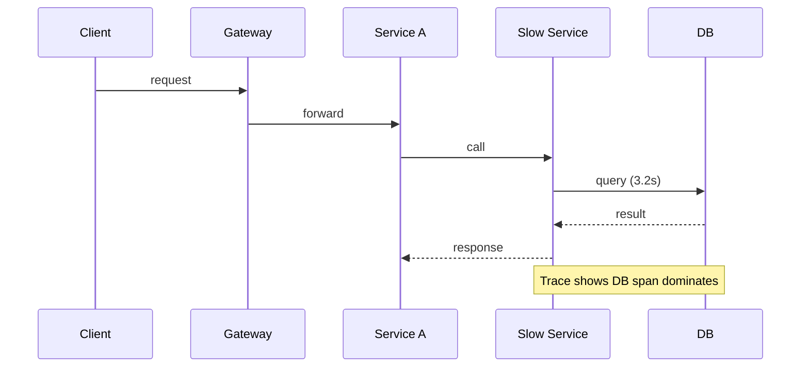

# Part G — Microservices (Q41–Q45)

[← Back to Index](00-INDEX.md)

---

## Q41 — One microservice is responding slowly. How do you find the root cause? ⭐🔧

### Thought process
Is the service sick, or is it waiting on someone else? Traces answer this fast.

### Answer

1. **Confirm** latency SLO burn for that service only  
2. **Open a slow trace** — where is time spent? internal vs downstream spans  
3. **Golden signals** for that service + its dependencies  
4. **Check pod health** — CPU throttle, restarts, GC, thread/event-loop lag  
5. **Check neighbors** — DB, Redis, Kafka consumer lag, another service  
6. **Recent changes** — deploy, config, traffic shift, noisy tenant  
7. **Compare versions** — canary vs stable  

### Common follow-ups
- How do you know it’s cold start vs sustained slowness?
- Sidecar (Envoy) latency vs app latency?

### What not to say
- Restarting the pod as the first and only step without evidence.

---

## Q42 — How do you debug communication between microservices?

### Answer

1. **Contracts** — request/response schemas, error codes, timeouts  
2. **Correlation IDs** propagated on every hop  
3. **Distributed traces** for the call graph  
4. **Access logs** at gateway + both services  
5. **mTLS / auth failures** — 401/403 between services  
6. **DNS / service discovery / network policies** in K8s  
7. **Payload size / serialization** mismatches (proto field evolution)  
8. **Retry storms** — duplicate side effects  

**Tools:** Jaeger/Zipkin/Tempo, Wireshark rare, `kubectl` exec curl to ClusterIP, contract tests (Pact).

### Common follow-ups
- Sync REST vs gRPC vs async events for debugging difficulty?
- Schema evolution strategies?

### What not to say
- Debugging only one side’s logs without correlation IDs.

---

## Q43 — How do you trace a request across multiple services? ⭐

### Thought process
This is **distributed tracing** + context propagation.

### Answer

1. Generate **`trace_id`** at the edge (gateway)  
2. Propagate via headers (`traceparent` W3C / B3)  
3. Each service creates **spans** for handler + outbound calls + DB  
4. Export to collector → Jaeger / Tempo / Datadog  
5. Also log `trace_id` in structured logs for join  

**Node example concept:** OpenTelemetry SDK instrumentation for Express + HTTP + Mongo.

### What interviewers like
Mention **sampling** (head-based), **baggage** carefully (PII), and **cardinality**.

### Common follow-ups
- How does sampling affect debugging rare bugs?
- Difference between logs, metrics, traces?

### What not to say
- Manually inventing uncorrelated IDs per service.

---

## Q44 — How do you handle failures between services? ⭐

### Answer — resilience patterns

| Pattern | Purpose |
|---------|---------|
| **Timeouts** | Bound wait time |
| **Retries + jitter** | Transient faults only; idempotent ops |
| **Circuit breaker** | Stop calling unhealthy dependency |
| **Bulkhead** | Isolate pools/resources |
| **Fallback** | Degraded response / cached |
| **Idempotency keys** | Safe retries |
| **Saga / compensation** | Distributed workflow rollback |
| **Dead letter queue** | Poison messages |

**Rule:** Fail fast, degrade gracefully, never retry non-idempotent payments blindly.

### Real-world example
Inventory service blip caused checkout timeouts. Circuit breaker opened after 50% errors / 30 s; checkout used reserved-stock cache + async reconcile; user saw slight delay message instead of hard 500s.

### Common follow-ups
- Exactly-once vs at-least-once?
- When not to retry?

### What not to say
- Infinite retries with no backoff.
- Ignoring idempotency for POST /payments.

---

## Q45 — What happens if one service is unavailable? ⭐

### Thought process
Describe **blast radius** and **designed behavior**.

### Answer

Without design: cascading timeouts → thread/pool exhaustion → fleet-wide outage.

With design:
1. Callers hit **timeouts/circuit breaker**  
2. Return **503/degraded** for features needing that service  
3. Non-critical paths skip (recommendations down; cart still works)  
4. Async flows buffer in Kafka until recovery  
5. Auto-heal: K8s restarts, HPA, multi-AZ  

**Platform pieces:** readiness probes so bad pods leave Service endpoints; podDisruptionBudgets; multi-replica.

### Common follow-ups
- Critical vs non-critical dependency matrix?
- Chaos engineering?

### What not to say
- “The whole system must go down together.” (Coupling red flag)

---

[← Back to Index](00-INDEX.md) · [Next: Monitoring →](08-monitoring.md)
