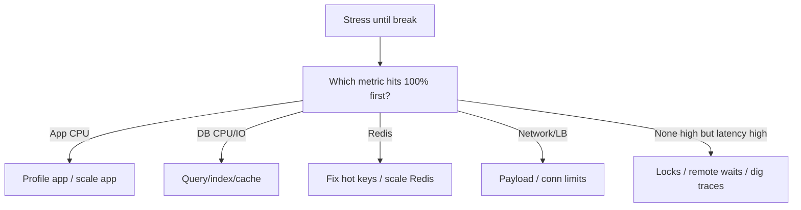

# Part I — Load Testing (Q51–Q55)

[← Back to Index](00-INDEX.md)

---

## Q51 — How do you determine how many users your application can support? ⭐

### Thought process
“Users” is ambiguous — convert to **RPS, concurrency, and workload mix**, then find the **breaking point** against SLOs.

### Answer

1. Define **user model** — DAU, peak concurrent, actions/min, read/write mix  
2. Translate to **target RPS** per endpoint  
3. Define **pass criteria** — e.g. p95 < 300 ms, error rate < 0.1%, CPU < 70%  
4. Load test (soak + peak + spike) in prod-like env  
5. Find **max sustainable RPS** before SLO breach  
6. Convert back to users with the model (with safety margin, often 30–50%)  
7. Revisit when features/data grow  

### Common follow-ups
- Concurrent users vs RPS?
- Why prod and staging capacity differ?

### What not to say
- A single number with no workload assumptions.

---

## Q52 — How would you conduct a load test? ⭐

### Answer — plan

1. **Goals & SLOs** clearly written  
2. **Scenarios** — realistic journeys (login → browse → checkout), not only one URL  
3. **Data** — prod-like volume & cardinality  
4. **Tooling** — JMeter, k6, Gatling, Artillery  
5. **Environments** — isolated; don’t accidentally DDoS prod third parties  
6. **Ramp** — warm-up → step up → peak → soak (30–120+ min for leaks)  
7. **Observe** app + DB + Redis + node metrics during test  
8. **Report** — graphs, bottleneck, recommendations  
9. **Retest** after fixes  

### JMeter sketch
Thread Group ramp 0→N users; HTTP samplers; listeners for p95; backend Grafana open in parallel.

### Common follow-ups
- Distributed load generators?
- How do you mock payment gateways?

### What not to say
- Hitting production without approval.
- Only testing happy-path GETs.

---

## Q53 — What metrics do you analyze after a load test?

### Answer

**Client-side (tool):** RPS achieved, latency percentiles, error %, throughput (bytes), timeouts  

**Server-side:** CPU, memory, GC, event loop lag, pod count  

**Dependencies:** DB CPU/QPS/slow queries, Redis hit rate/CPU, queue lag  

**Efficiency:** latency vs RPS curve; cost per 1k requests  

**Stability:** soak memory trend; error clusters by type  

### Common follow-ups
- Why p99 matters more than average?
- Coordinated omission in load tools?

### What not to say
- Only looking at average response time.

---

## Q54 — During load testing, response times increase gradually. Reasons?

### Thought process
Gradual rise ⇒ resource leak, queueing, cache decay, GC pressure, or connection pool saturation — not a sharp cliff only.

### Answer — likely causes

1. **Memory leak** → GC thrash → latency  
2. **Connection pool / thread queueing** building up  
3. **Cache cold → warm → eviction** under pressure  
4. **DB buffer cache / WiredTiger cache** thrashing  
5. **Queue depths** growing (async backpressure into API)  
6. **Log volume / disk fill**  
7. **Temperature** of CPU throttling over time (less common)  
8. **Test data unique keys** defeating cache  

### Common follow-ups
- How do you distinguish leak vs queueing?
- Why soak tests matter?

### What not to say
- “The load generator is always wrong” without checking server saturation.

---

## Q55 — How do you identify the bottleneck during a stress test?

### Answer

1. Push past expected peak until SLO breaks  
2. Watch **which resource saturates first** (CPU app? DB IO? Redis? network?)  
3. Use **traces** at failure point — longest span  
4. Plot **latency vs RPS** and **error onset**  
5. Apply **utilization law** intuition: if DB CPU 100% while app CPU 40% → DB bottleneck  
6. Confirm by **relieving** that resource (cache that query, scale that tier) and retesting  

### Common follow-ups
- Knee of the curve?
- How do you validate the bottleneck hypothesis?

### What not to say
- Scaling all tiers blindly without identifying the limiter.

---

[← Back to Index](00-INDEX.md) · [Next: Security →](10-security.md)
