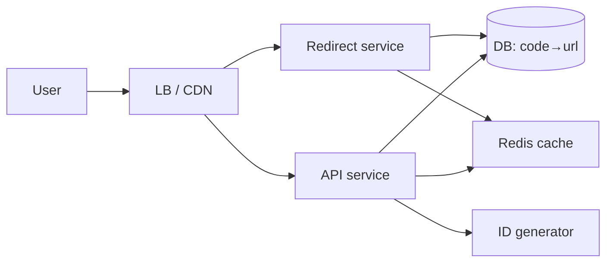
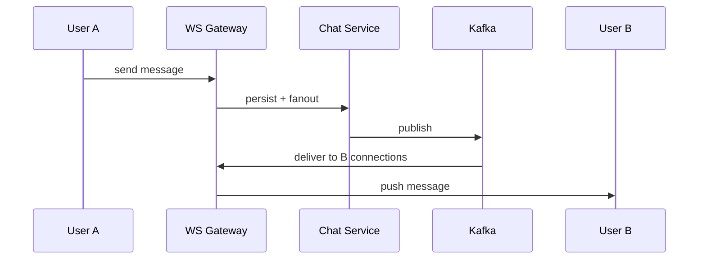
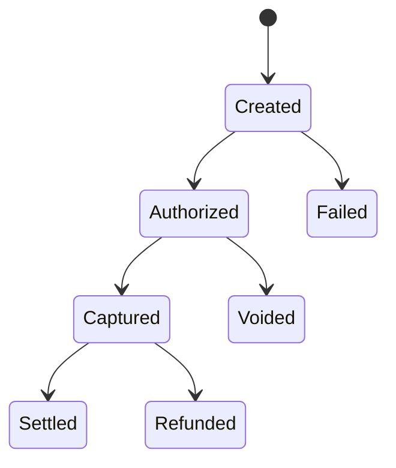

# Part K — System Design (Q61–Q68)

[← Back to Index](00-INDEX.md)

> **How to answer design questions:** clarify requirements → estimate scale → API/data model → high-level diagram → deep dives → trade-offs → failures.

---

## Q61 — Design a URL Shortener ⭐📐

### Thought process
Classic: write path (create short link), read path (302 redirect), uniqueness, scale of redirects ≫ creates.

### Clarify
- Custom aliases? expiry? analytics? auth? scale (e.g. 100M URLs, 10k QPS redirects)?

### API
- `POST /urls` `{ longUrl }` → `{ code, shortUrl }`  
- `GET /:code` → `302 Location: longUrl`

### Design

**Key ideas**
- **ID generation:** base62 encode unique counter (Redis INCR) or Snowflake IDs; handle collisions  
- **Cache** hot redirects in Redis  
- **DB:** key-value (`code` PK, `longUrl`, `createdAt`, `expiresAt`) — Cassandra/Dynamo/Mongo all viable  
- **Analytics:** async Kafka click events  
- **301 vs 302:** 301 caches at client/CDN (careful if editable)

### Follow-ups
- Custom aliases uniqueness; abuse/malware scanning; geo-distributed redirects

### What not to say
- Hash(longUrl) only without collision/idempotency story.
- Skipping cache on read-heavy path.

---

## Q62 — Design a Chat Application ⭐📐

### Clarify
1:1 vs groups? delivery guarantees? history? media? online presence? scale?

### Core components
- **Gateway (WebSocket)** for realtime  
- **Chat service** — message fan-out  
- **Presence service**  
- **Media store** (S3) + CDN  
- **Message store** (Cassandra/Mongo by conversationId + timestamp)  
- **Push notifications** for offline  
- **Kafka** for fan-out to large groups  

### Deep dives
- Connection stickiness / pub-sub so any gateway can reach user  
- Ordering per conversation; idempotent message IDs  
- Read receipts eventual  
- Group chat: fan-out on write vs fan-out on read  

### What not to say
- Pure REST polling as the only realtime strategy at chat scale.
- Single Mongo primary for all global websocket fan-out without a plan.

---

## Q63 — Design a Notification Service 📐

### Clarify
Channels: email, SMS, push, in-app? preferences? templates? rate limits? retries?

### Design
- **API** `POST /notifications` (or events from Kafka)  
- **Orchestrator** applies user preferences & quiet hours  
- **Channel workers** (email/SMS/FCM)  
- **Template service**  
- **Provider adapters** with circuit breakers  
- **Idempotency keys** to avoid duplicate sends  
- **Status store** + DLQ for failures  

**Priorities / queues:** separate high-priority OTP vs marketing.

### Follow-ups
- Exactly-once delivery? (usually at-least-once + idempotent providers)
- Multi-tenant rate limits

### What not to say
- Sending email synchronously inside the user signup HTTP request only.

---

## Q64 — Design an Online Quiz Platform 📐

### Clarify
Live timed quizzes? anti-cheat? millions concurrent (game show)? question bank admin?

### Design highlights
- **Quiz service** — definitions, schedules  
- **Session service** — user attempts, timers (server-authoritative time)  
- **Question bank** — never send answers to client early  
- **Realtime** WebSocket for live leaderboard  
- **Scoring workers** — async grade; Redis sorted set for leaderboard  
- **Anti-cheat** — shuffle options, server validation, rate limits, proctoring hooks  

**Peak pattern:** pre-warm Redis; avoid DB writes per click — buffer answers then flush.

### What not to say
- Trusting client-side timer/score.

---

## Q65 — Design a File Upload Service 📐

### Clarify
Max size? virus scan? resumable? private/public? image transforms?

### Preferred design (direct-to-storage)
1. Client requests **pre-signed URL** (S3) from API  
2. Client uploads **directly to S3**  
3. S3 event → virus scan worker → mark `clean`  
4. API stores metadata (owner, key, mime, size, status)  
5. Downloads via signed URLs / CDN  

**Also:** multipart upload for large files; size/MIME allowlists; quarantine bucket.

### What not to say
- Streaming all multi-GB files through Node API memory (OOM risk).

---

## Q66 — Design a Rate Limiter ⭐📐

### Clarify
Limit per user/IP/API key? distributed? response behavior (429 + headers)?

### Algorithms
| Algorithm | Notes |
|-----------|-------|
| Token bucket | Bursts allowed |
| Leaky bucket | Smooth rate |
| Fixed window | Simple; burst at edges |
| Sliding window log/counter | Fairer |

### Distributed implementation
- Redis `INCR` + `EXPIRE` or Lua for atomicity  
- Or Redis + token bucket script  
- Gateway (Kong/Nginx/Envoy) for edge limits + app limits for business quotas  

**Headers:** `Retry-After`, `X-RateLimit-Remaining`

### Follow-ups
- Fail-open vs fail-closed if Redis down  
- Different limits per endpoint tier  

### What not to say
- In-memory Map only on multi-instance deploy (inconsistent limits).

---

## Q67 — Design a Payment Processing Service 📐

### Thought process
Correctness > latency. Idempotency, ledgers, PCI scope reduction.

### Design
- **Never store PAN** — use Stripe/Adyen tokens / payment intents  
- **Payment service** creates intent; webhook confirms  
- **Idempotency key** on charge APIs  
- **Ledger** double-entry for money movement  
- **State machine:** created → authorized → captured → settled / failed / refunded  
- **Outbox pattern** for reliable events  
- **Reconciliation jobs** with provider  

### What not to say
- Fire-and-forget charges without idempotency.
- Building raw card vault without PCI plan.

---

## Q68 — Design a Real-time Dashboard 📐

### Clarify
Metrics freshness (1s vs 1min)? viewers? custom queries? multi-tenant?

### Design
- **Producers** emit metrics/events → Kafka  
- **Stream processors** aggregate windows  
- **Hot store** Redis / Timescale / ClickHouse for query  
- **Push** WebSocket/SSE to browsers  
- **Fallback poll** every N seconds  
- **Pre-aggregate** popular tiles; avoid raw scan per viewer  

**Fan-out:** one aggregation pipeline, many subscribers.

### What not to say
- Each browser hitting OLTP Mongo with heavy aggregations every second.

---

### System design “What not to say” (global)
- Jumping to tech buzzwords without requirements  
- Ignoring failure modes and data consistency  
- No capacity estimate at all for senior roles  

[← Back to Index](00-INDEX.md) · [Next: Workplace Scenarios →](12-workplace-scenarios.md)
